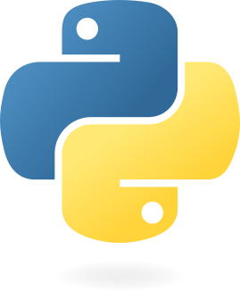

# 🧰 Python Virtual Environment Setup on Linux, Windows & macOS (Deep Learning Ready)

> 📌 **Author:** Dishanand Jayeprokash  
> 🗓️ **Created:** 17 July 2025  
> ✏️ **Last Modified:** 25 August 2026  
> 📘 **Covers:** Virtual Environment Setup (Linux • Windows • macOS) • VS Code Integration • Package Installation • Requirements Management

---

<p align="center">
  
  &nbsp;&nbsp;&nbsp;
  
</p>

---
## 📚 Table of Contents

1. [🌐 Create a Virtual Environment](#-create-a-virtual-environment)
2. [⚡ Activate the Environment](#-activate-the-environment)
3. [🧭 Select Interpreter in VS Code](#-select-interpreter-in-vs-code)
4. [📦 Install Required Packages](#-install-required-packages)
5.  [📂 Sample `requirements.txt`](#-sample-requirementstxt)
6. [🧪 Verify Package Installation](#-verify-package-installation)
8. [📉 Deactivate Virtual Environment](#-deactivate-virtual-environment)
9. [🎉 Conclusion](#-conclusion)
10. [📘 Detailed Setup Reference](#-detailed-setup-reference)
11. [📬 Feedback](#-feedback)

> 🖥️ **Note:** Steps 1–3 below are split by operating system (Windows / Linux / macOS). Everything from [📦 Install Required Packages](#-install-required-packages) onward is the same across all three, since it uses `pip` and Python directly.

---

## 🌐 Create a Virtual Environment

Open your terminal and run the command for your OS.

### 🐧 Linux

```bash
python3 -m venv myvenv
```

> ℹ️ On Debian/Ubuntu-based distros, if you get an error that the `venv` module is missing, install it first:
> ```bash
> sudo apt update
> sudo apt install python3-venv
> ```

### 🪟 Windows

```bash
python -m venv myvenv
```

> ℹ️ `python -m venv` uses the built-in `venv` module to set up the environment.

### 🍎 macOS

```bash
python3 -m venv myvenv
```

> ℹ️ macOS ships with Python 3 via Xcode Command Line Tools, but it's recommended to install Python via [python.org](https://www.python.org/downloads/) or [Homebrew](https://brew.sh/) (`brew install python`) for the latest version.

All three commands create a folder named `venv` which contains your isolated Python environment.

---

## ⚡ Activate the Environment

### 🪟 Windows

In PowerShell or Command Prompt:

```bash
myvenv\Scripts\activate
```

> 🛡️ **Execution Policy Error?**
> If you see something like:

```
myvenv\scripts\Activate.ps1 cannot be loaded because running scripts is disabled on this system.
```

🔧 Fix it by running:

```bash
Set-ExecutionPolicy -Scope CurrentUser -ExecutionPolicy RemoteSigned
```

### 🐧 Linux

```bash
source myvenv/bin/activate
```

### 🍎 macOS

```bash
source myvenv/bin/activate
```

> ✅ On Linux and macOS your prompt will change to show `(myvenv)`, confirming the environment is active.

**To deactivate on any OS** (Windows, Linux, or macOS), simply run:

```bash
deactivate
```

---

## 🧭 Select Interpreter in VS Code

1. Open **Command Palette**:
   - Windows/Linux: `Ctrl + Shift + P`
   - macOS: `Cmd + Shift + P`
2. Type: `Python: Select Interpreter`
3. Choose the one that points to your `myvenv` folder:

   | OS            | Interpreter Path              |
   | ------------- | ------------------------------ |
   | 🪟 Windows    | `.\myvenv\Scripts\python.exe`    |
   | 🐧 Linux      | `./myvenv/bin/python`            |
   | 🍎 macOS      | `./myvenv/bin/python`            |

✅ This ensures VS Code uses your virtual environment.

> 💡 **Tip:** If your `myvenv` folder doesn't appear in the interpreter list, click **"Enter interpreter path…"** in the picker and browse to the path above manually, or open VS Code from inside the project folder that already contains `myvenv` (`code .` on Linux/macOS).

---

## 📦 Install Required Packages

To install packages:

```bash
pip install torch
```

Or use a `requirements.txt` file:

```bash
pip install -r requirements.txt
```

This is more scalable and version-controlled.

---

## 📂 Sample `requirements.txt`

Create a new file to the current directory and save it as requirements.txt. Copy paste the following, save it, and install it as shown above:

```txt
torch>=2.0.0
torchvision>=0.15.0
numpy
matplotlib
opencv-python
Pillow
tifffile
rasterio
scikit-image
geopandas
pyproj
tqdm
```

### 🔍 Why These Packages?

| Package                   | Purpose                    |
| ------------------------- | -------------------------- |
| `torch`, `torchvision`    | Deep learning              |
| `numpy`, `matplotlib`     | Arrays & plotting          |
| `opencv-python`, `Pillow` | Image loading & processing |
| `tifffile`, `rasterio`    | TIFF/GeoTIFF support       |
| `scikit-image`            | Extra image processing     |
| `geopandas`, `pyproj`     | Geospatial metadata        |
| `tqdm`                    | Progress bars for loops    |

---


## 🧪 Verify Package Installation

You can check installed packages with:

```bash
pip list
```

> ❌ But this is tedious for long lists. So...

### ✅ Use a verification script:

Run the included script:

```bash
python verify_requirements.py
```
The script can be obtained from [verify_requirements.py](https://github.com/djayepro3/Windows-Venv-Python-Setup/blob/main/setup/verify_requirements.py).

It will:

* ✅ Validate installed packages and versions
* 📝 Log missing packages to `missing_packages.log`
* 📦 Log extra packages to `extra_packages.log`
* 💡 Show install summary

---

## 📉 Deactivate Virtual Environment

When done, the command is identical on **Windows, Linux, and macOS**:

```bash
deactivate
```

### ✅ Why deactivate?

* Resets your shell to system Python
* Avoids accidental installs into the wrong env
* Keeps your project tidy
* Helps when switching between multiple projects

---

## 🎉 Conclusion

You now have a clean, portable Python environment ready for deep learning and geospatial processing — on **Windows, Linux, or macOS**!

> 💡 Use this setup to power your preprocessing pipelines, generative models, or inference tools in an isolated and reproducible way.

---

## 📘 Detailed Setup Reference

📄 For a more detailed walkthrough with step-by-step commands and background info, check out:  
[**Win_venv.txt**](setup/create_Venv_Windows.txt)

This text file includes:
- How to create and activate a virtual environment
- Common errors and their fixes (e.g., PowerShell script execution)
- How to choose interpreters in VS Code
- Package installation techniques and reasoning
- Full explanation of package roles for ML and geospatial work
- A custom script (`verify_requirements.py`) to track missing/extra packages

> 🧠 Use this as your offline cheat sheet or printout!

---

## 📬 Feedback

Have suggestions or want to contribute?
Feel free to **fork the repo**, open an **issue**, or submit a **pull request**.

---

## 📦 Clone This Repo

1. Clone the repository:
    ```bash
    git clone https://github.com/djayepro3/Windows-Venv-Python-Setup
    ```
2. Navigate to the project directory:
    ```bash
    cd Windows-Venv-Python-Setup
    ```
